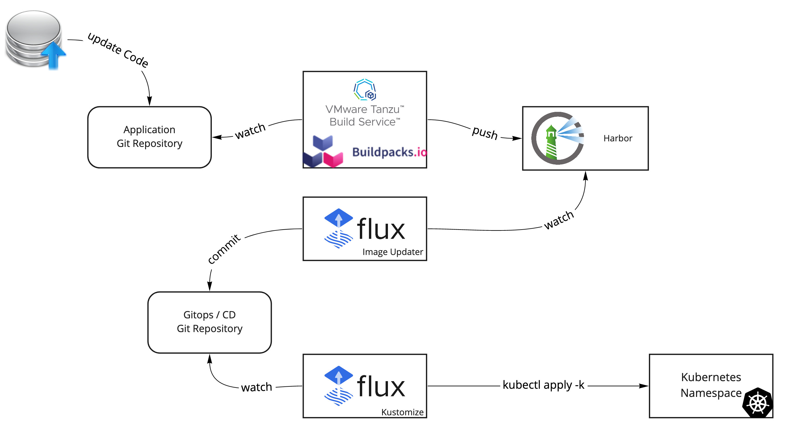

# KPACK Awesome Demo



## Setup 

kpack is the kubernetest implementation of the pack, the cloud native buildpack technologie used before.

pre-requisite: [install kpack](https://github.com/pivotal/kpack/blob/main/docs/install.md) on your Kubernetes cluster

## common object

```bash
kubectl apply -f kpack/common -n kpack
```

## nodejs 

```bash
kubectl apply -f kpack/nodejs -n kpack
```

Check the configuration is ok 

```bash
kubectl get Builder -n kpack node-builder
kubectl get Image -n kpack cnb-nodejs-image
kubectl get builds.kpack.io -n kpack
```

Follow the logs of the build:

```bash
logs -namespace kpack -image cnb-nodejs-image
```


## SpringBoot 

Source: https://github.com/bmoussaud/cnb-springboot

```bash
kubectl apply -f kpack/springboot -n kpack
```

Check the configuration is ok 

```bash
kubectl get Builder springboot-builder-11.0.10
kubectl get Builder springboot-builder-11.0.10 -o yaml | bat -l yaml
kubectl get Image -n kpack cnb-springboot-image
kubectl get builds.kpack.io -n kpack
```

Follow the logs of the build:

```bash
logs -namespace kpack -image cnb-springboot-image
```

## .NET Core (ASP.NET) 

```bash
kubectl apply -f kpack/dotnetcore -n kpack
```

Check the configuration is ok 

```bash
kubectl get Builder -n kpack dotnetcore-builder
kubectl get Image -n kpack cnb-dotnetcore-image
kubectl get builds.kpack.io -n kpack
```

Follow the logs of the build:

```bash
logs -namespace kpack -image cnb-dotnetcore-image
```

## Deploy the applications

````
kubectl apply -k app/nodejs
kubectl apply -k app/springboot
kubectl apply -k app/dotnetcore
````


## Vizualize the kpack in action

https://github.com/matthewmcnew/kpdemo


## GitOps

Ref: 
* https://fluxcd.io/docs/guides/image-update/
* https://particule.io/blog/flux-auto-image-update/

Install fluxcd on the K8S `aws-tools` cluster managened by the `kpack-awesome-demo` repository managed by the `${GITHUB_OWNER}`

```bash
export GITHUB_TOKEN=xxxxx
export GITHUB_OWNER=bmoussaud
flux bootstrap github --components-extra=image-reflector-controller,image-automation-controller --owner=${GITHUB_OWNER} --repository=kpack-awesome-demo --branch=main --path=./clusters/aws-tools --personal --read-write-key 

kubectl create secret generic https-github-credentials  -n flux-system  --from-literal=username=${GITHUB_OWNER} --from-literal=password=${GITHUB_TOKEN}
```

Force Flux to reconcile:

```bash
flux reconcile kustomization flux-system --with-source
```

Chech Image configuration (Ready = True)

```bash
flux get image repository 
flux get image policy
```

## Demo

* Display the resources

````
kp clusterstore list
kp clusterstack list
kp builder list
kp image list  or kubectl get images.kpack.io -A
kp build list or kubectl get builds.kpack.io -A
````

````
kp image status cnb-springboot-image
kp build status cnb-springboot-image
kp build logs   cnb-springboot-image
````

* Modify the springboot project configuration: `https://github.com/bmoussaud/cnb-springboot/blob/master/src/main/resources/application.yml`
* Show the build is running on commit
  * open kpack navigator ui to show 
  * `watch kubectl get pod -n kpack`
  * `logs -namespace kpack -image cnb-springboot-image` or `kp build logs cnb-springboot-image`
* Show the harbor repository with the new image `https://harbor.mytanzu.xyz/harbor/projects/1/repositories/cnb-springboot`
  * show the details and environment variable `kpack.builder.author`
* Show the application has been updated
  * `watch kubectl get pod -n cnb-springboot`
  * ui `http://springboot-kpackdemo.mytanzu.xyz/`
* Modify the image to switch to java 11.0.12
  * `kubectl edit image -n kpack cnb-springboot-image` or  `kp image patch cnb-springboot-image --builder springboot-builder-11.0.12`
  * replace `11.0.10` with `11.0.12`


## Reset Demo

````
kp image patch cnb-springboot-image --builder springboot-builder-11.0.10
`````

## Contribute

Contributions are always welcome!

Feel free to open issues & send PR.

## License

Copyright &copy; 2021 [VMware, Inc. or its affiliates](https://vmware.com).

This project is licensed under the [Apache Software License version 2.0](https://www.apache.org/licenses/LICENSE-2.0).
